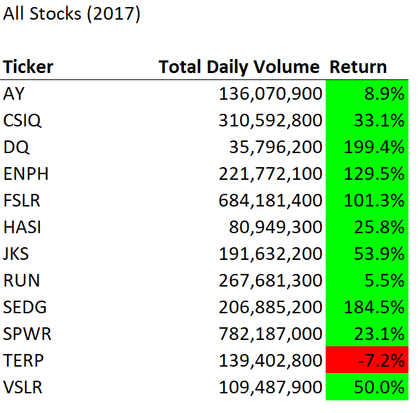
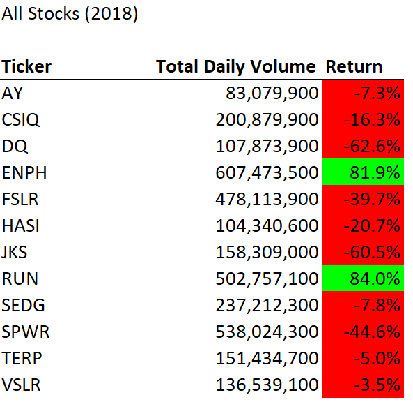
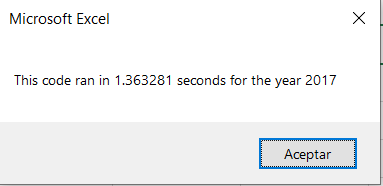
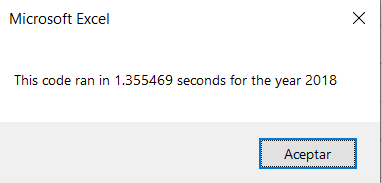
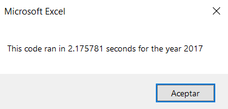
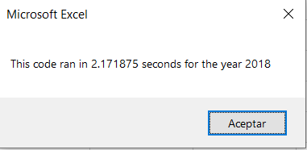

# Green stocks analysis for 2017 and 2018

## Overview of the Project

The goal of this project was to help our friend Steve analyze how green stocks performed during 2017 and 2018 so he could make recomendations to their parents in their investment portfolio. We looked 12 different stocks in this sector and the data analyzed was the total daily volume and the yearly return. The tickers analyzed are listed below:
- AY
- CSIQ
- DQ
- ENPH
- FSLR
- HASI
- JKS
- RUN
- SEDG
- SPWR
- TERP
- VSLR
## Results

### Green Stocks Results 2017

As we can see the stocks performed very well in 2017 as all but one (TERP) had a positive return. Even the stock that had the smaller positive return (RUN) managed a 5.5% yearly return and the stock with the highest return was DQ with a whopping 200%!!

### Green Stocks Results 2018

The story was very different in 2018 as most of the stocks suffered a loss duirng this year, ENPH and RUN continued on the upward trend. Also if we consider that most companies analyzed didn't lose all of their gainings from 2017 I would consider them a would investment still and I would recomend holding. The onlly stock tha reported losses on both 2017 and 2018 was TERP, so I would recommend keeping and eye on it.

## Code Performace (Original code vs Refactored code)

During this analysis we prepared two codes that returned the same results, the only difference was that the second code was refactored to improve its logic and make it easier for future users to read and use or to simply make the code more efficient so it runs faster in uses less resources. 

Original Code Run Times:

                              

Refactored Code Run Times:

                             

## Summary

### Advantages and disadvantages of refactoring code

When a code is refactored it will be better organized and it might be easier to for future users to read and use the code. The cons of refactoring a code are that it might not improve performance and it won't be any more functional than it was before. Also you could potentially introduce errors in the refactoring process.

### Advantages and disadvantages of the original and refactored VBA script

As you can see from the run times in the result section, in this particular case refactoring the code didn't reduce the time it takes the code to run. This means that the refactored code didn't increase performance. This could be because the variables are stored in arrays that define its value using loops, this makes the code easier to edit in the future in case we need to add more stocks or more years to the analysis but because it takes an extra step it makes the code run slower.
